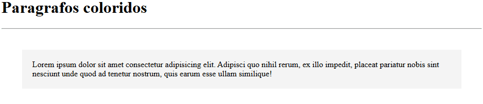

# Parágrafos coloridos
Um projeto de texto com um arquivo README📌

[]

# Tecnologias utilizadas
- HTML
- CSS

## Como utilizar

1 - clone o projeto
```
git clone
```
2 - Acesse a pasta do projeto
```
cd repositorio-com-readme
```